# Triton: A Language and Compiler for Custom Deep Learning Primitives

## 1. What is Triton?

**Triton** is an open-source programming language and compiler designed to make it easier to write highly efficient custom Deep Learning primitives (kernels) for GPUs. It allows researchers and engineers to write code in Python that achieves performance comparable to highly optimized CUDA C++ kernels, but with significantly less effort and complexity.

## 2. Why Do We Need It?

*   **Productivity vs. Performance Gap**: Before Triton, you had two choices:
    *   **High Productivity**: Use PyTorch/TensorFlow. Easy to write, but limited to pre-defined kernels. If you needed a custom operation, it was slow.
    *   **High Performance**: Write CUDA C++. Extremely fast, but very difficult to learn, write, debug, and maintain.
*   **Triton bridges this gap**: It gives you the control of CUDA (managing memory hierarchy, tiling) with the syntax and ease of Python.

## 3. High-Level Architecture

Triton uses a multi-stage compilation pipeline based on **MLIR** (Multi-Level Intermediate Representation).

```mermaid
graph TD
    UserCode["User Code (Python)"] -->|"&#64;triton.jit"| Frontend
    subgraph Frontend
        AST["AST Visitor"]
        Pipeline["Pipeline Manager"]
    end
    Frontend -->|"Triton-IR"| Optimizer
    subgraph Optimizer
        TTIR["Triton-IR (TTIR)"] -->|Conversion| TTGIR["TritonGPU-IR (TTGIR)"]
        TTGIR -->|Conversion| LLIR["LLVM-IR"]
    end
    Optimizer -->|"LLVM-IR"| Backend
    subgraph Backend
        Target["Target Code Gen"]
        PTX["PTX / AMDGCN"]
    end
    Backend -->|Binary| Runtime
    subgraph Runtime
        Driver["Driver (CUDA/ROCm)"]
        Launcher["Kernel Launcher"]
    end
```



## 4. Architecture Deep Dive & Code Snippets

### Layer 1: Frontend (Python DSL)
You write kernels using the `triton.language` module. The `@triton.jit` decorator captures your function.

**File**: [python/triton/language/core.py](file:///d:/CS/SEM1/subjects/CSE 598/triton-main/triton-main/python/triton/language/core.py)

This file defines the language primitives. For example, `to_tensor` is a builtin that hooks into the compiler's semantic analysis.

```python
@builtin
def to_tensor(x, _semantic=None):
    return _semantic.to_tensor(x)
```

It also defines types like `constexpr` which are critical for meta-programming in Triton kernels:

```python
class constexpr(base_value):
    """
    This class is used to store a value that is known at compile-time.
    """
    def __init__(self, value):
        self.value = value
```

### Layer 2: Intermediate Representation (MLIR)
The compiler converts Python AST into **Triton-IR (TTIR)**. This is where high-level operations like "Load a Block" are defined.

**File**: [lib/Dialect/Triton/IR/Ops.cpp](file:///d:/CS/SEM1/subjects/CSE 598/triton-main/triton-main/lib/Dialect/Triton/IR/Ops.cpp)

Here is how the `LoadOp` (load operation) is built in C++. It handles things like masks, boundary checks, and cache modifiers.

```cpp
void LoadOp::build(OpBuilder &builder, OperationState &state, Value ptr,
                   Value mask, Value other, ArrayRef<int32_t> boundaryCheck,
                   std::optional<PaddingOption> padding, CacheModifier cache,
                   EvictionPolicy evict, bool isVolatile) {
  // ... logic to build the MLIR operation ...
  LoadOp::build(builder, state, ptr, mask, other,
                builder.getDenseI32ArrayAttr(boundaryCheck), paddingAttr, cache,
                evict, isVolatile);
}
```

### Layer 3: Backend (LLVM Conversion)
The optimized Triton-IR is lowered to **LLVM-IR**, which is a low-level, hardware-agnostic representation. This step maps high-level tensor ops to pointer arithmetic and SIMD instructions.

**File**: [lib/Conversion/TritonGPUToLLVM/ElementwiseOpToLLVM.cpp](file:///d:/CS/SEM1/subjects/CSE 598/triton-main/triton-main/lib/Conversion/TritonGPUToLLVM/ElementwiseOpToLLVM.cpp)

For example, `AddPtrOp` (adding an offset to a pointer) is converted to an LLVM `getelementptr` (GEP) instruction:

```cpp
struct AddPtrOpConversion : public ConvertOpToLLVMPattern<AddPtrOp> {
  LogicalResult matchAndRewrite(AddPtrOp op, OpAdaptor adaptor,
                  ConversionPatternRewriter &rewriter) const override {
    // ...
    // Generate LLVM GEP (Get Element Pointer) instruction
    Value result = b.gep(resultPtrTy, resultElemTy, adaptor.getPtr(),
                           adaptor.getOffset());
    rewriter.replaceOp(op, result);
    return success();
  }
};
```

## 5. What are MLIR and LLVM?

*   **LLVM (Low Level Virtual Machine)**: A standard compiler infrastructure used by many languages (C++, Rust, Swift). It provides a common intermediate representation (LLVM-IR) that can be compiled to machine code for any architecture (x86, ARM, NVPTX).
*   **MLIR (Multi-Level IR)**: A newer framework (part of LLVM project) that allows building "dialects" of IR.
    *   Triton defines its own dialects (**Triton-IR** and **TritonGPU-IR**) to represent high-level concepts like "tensors" and "blocks" before lowering them to the low-level scalar instructions of LLVM.

## 6. Advantages vs. PyTorch & CUDA

| Feature | PyTorch | CUDA C++ | Triton |
| :--- | :--- | :--- | :--- |
| **Ease of Use** | High (Python) | Low (C++) | **High (Python)** |
| **Performance** | Good (for standard ops) | Best | **Near-Best** |
| **Flexibility** | Low (hard to fuse ops) | High | **High** |
| **Compilation** | Eager / Graph | Ahead-of-Time | **JIT (Just-In-Time)** |

*   **Vs. PyTorch**: Triton allows you to write *fused kernels*. Instead of reading/writing to memory between every operation (like PyTorch does), Triton keeps data in fast SRAM (cache), performing multiple operations before writing back. This drastically reduces memory bandwidth usage.
*   **Vs. CUDA**: Triton automates the hardest parts of CUDA programming: memory coalescing, shared memory management, and thread synchronization. You write block-level logic, and the compiler handles the thread-level details.

## 7. Demo Implementation Deep Dive

We have built a standalone demo application to showcase this.

**File**: [demo_app/matmul_demo.py](file:///d:/CS/SEM1/subjects/CSE 598/triton-main/demo_app/matmul_demo.py)

### The Triton Kernel (`matmul_kernel`)

The kernel uses **Blocked Matrix Multiplication**. It divides the output matrix $C$ into small blocks (e.g., 128x128) and computes them in parallel.

**1. Program ID & Block Mapping**
Each instance of the kernel (program) computes one block of $C$. We calculate which block `pid` corresponds to.

```python
pid = tl.program_id(axis=0)
# ... calculations to find pid_m (row block) and pid_n (col block) ...
```

**2. Pointer Arithmetic**
We calculate pointers to the starting blocks of $A$ and $B$. `offs_am` and `offs_bn` are arrays of offsets (0..127, 0..63 etc).

```python
offs_am = (pid_m * BLOCK_SIZE_M + tl.arange(0, BLOCK_SIZE_M)) % M
offs_bn = (pid_n * BLOCK_SIZE_N + tl.arange(0, BLOCK_SIZE_N)) % N
offs_k = tl.arange(0, BLOCK_SIZE_K)
a_ptrs = a_ptr + (offs_am[:, None] * stride_am + offs_k[None, :] * stride_ak)
b_ptrs = b_ptr + (offs_k[:, None] * stride_bk + offs_bn[None, :] * stride_bn)
```

**3. The Main Loop (Accumulation)**
We iterate along the $K$ dimension (shared dimension of $A$ and $B$). We load blocks of $A$ and $B$ into SRAM, multiply them, and accumulate the result.

```python
accumulator = tl.zeros((BLOCK_SIZE_M, BLOCK_SIZE_N), dtype=tl.float32)
for k in range(0, tl.cdiv(K, BLOCK_SIZE_K)):
    # Load blocks from global memory to SRAM
    a = tl.load(a_ptrs, mask=offs_k[None, :] < K - k * BLOCK_SIZE_K, other=0.0)
    b = tl.load(b_ptrs, mask=offs_k[:, None] < K - k * BLOCK_SIZE_K, other=0.0)
    
    # Matrix multiplication on the blocks (happens in Tensor Cores)
    accumulator = tl.dot(a, b, accumulator)
    
    # Advance pointers to the next block
    a_ptrs += BLOCK_SIZE_K * stride_ak
    b_ptrs += BLOCK_SIZE_K * stride_bk
```

**4. Store Result**
Finally, we write the accumulated block back to global memory $C$.

```python
c = accumulator.to(tl.float16)
tl.store(c_ptrs, c, mask=c_mask)
```

### Benchmarking
The `benchmark` function runs the Triton kernel, a PyTorch `torch.matmul`, and a custom CUDA C++ kernel, measuring the execution time and calculating TFLOPS.

```python
if provider == 'triton':
    ms, min_ms, max_ms = triton.testing.do_bench(lambda: matmul(x, y), quantiles=quantiles)
```

## 8. Disadvantages

*   **Debugging**: Debugging JIT-compiled GPU code is notoriously difficult. While Triton has some tools, it's harder than debugging standard Python.
*   **Platform Support**: Primarily optimized for NVIDIA GPUs. AMD support is improving (ROCm), but CPU support is still experimental.
*   **Latency**: There is a small compilation overhead the first time a kernel is run (warm-up time).
*   **Complexity for Simple Ops**: For very simple element-wise operations, standard PyTorch is often "fast enough" and simpler to use.
